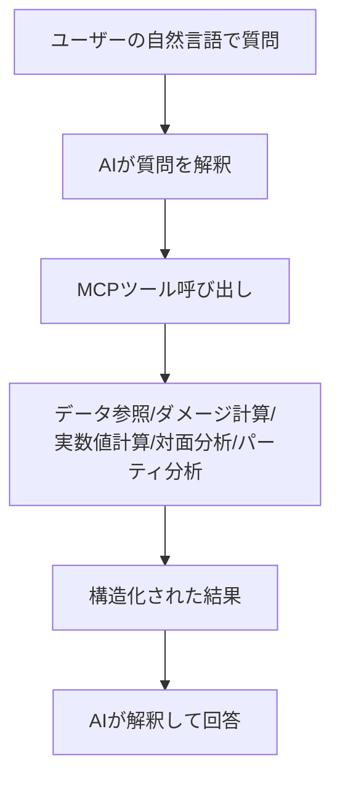

こんにちは。nonz250 です。皆さんはポケモンバトルをやっていますか？
わたしはポケモンチャンピオンズが発売されたから復帰した復帰勢です。

ポケモンチャンピオンズでポケモンバトルをする際に AI からアドバイスがもらえるツール `@nonz250/ai-rotom` を作ってみました。

@[card](https://github.com/nonz250/ai-rotom)

ここでは @nonz250/ai-rotom 作った際に考えた設計思想や、どうやって作成したかなど、技術的な内容を中心に書いてみたいと思います。  

## はじめに

ポケモンバトルの考察には、多岐にわたる種類の仕事が混ざっています。

- ポケモンや技の情報を引く
- ダメージ計算をする
- 素早さや耐久ラインを確認する
- 対面や選出を評価する
- その結果をもとに構築や育成論を考える

これらを判断するためのツールは世界中で作られています。もはやポケモン攻略サイトにはダメ計が必須ですよね。

人間向けのツールはすでにたくさんあります。  
しかし、それを横断して整理し、比較し、最後に考察へまとめるのは、やはり人間の役割です。

そこで作ったのが、ポケモンチャンピオンズ向けのバトルアドバイザー `ai-rotom` です。
この記事では、`ai-rotom` をどういう責務分担で設計したか、何をデータとして固定し、何をAIに委ねたかを書きます。

## この記事で書くこと

- `ai-rotom` をどういう責務分担で設計したか
- 何をデータとして固定し、何をAIに委ねたか
- なぜ MCP にしたか
- 実際に使って分かった強みと限界、発想

## なぜ作ろうと思ったか

このプロジェクトを作ろうと思った直接のきっかけは、ポケモンバトルに復帰して「考察の入口が思った以上に重い」と感じたことでした。

強いポケモン、主流の型、対面の有利不利、選出、ダメージ計算。今の育成論はひとつの配分や技構成だけで完結せず、環境理解や仮想対面の整理まで含めてようやく形になります。しかもポケモンチャンピオンズでは育成のハードルが下がり、試行回数が増える分、環境の変化も速い。短い時間でそれを追いかけるのは、かなり厳しいと感じました。

**もちろん、その考察こそがこのゲームの醍醐味であることは理解しています。**

人間向けのツールはすでにたくさんあり、ダメージ計算、図鑑、育成論、検索、使用率集計、ないものはないはずです。  
しかし、やはりゲームをしながらそのツールを使うとか、普段の忙しい生活の中でそのツールと向き合いながら育成論を考えるのは、思った以上に大変なことでした。

私が感じた課題はツールが足りないことではなく、それらをどう使い、どう比較し、どう考察としてまとめるかが最後まで人間の役割として残ることでした。  

私が欲しかったのは、革新敵な単機能のツールではなく、**ツールを使った上で一緒に考えてくれる知能** だったのです。

その発想から作ったのが、ポケモンチャンピオンズ向けバトルアドバイザー `ai-rotom` です。

## 解きたかった問題

ポケモンの考察をAIにやらせようとすると、最初にぶつかるのは「AIに全部やらせると不安定」という問題です。

たとえば、こんな問いを考えます。

```
$ ガブリアスとギャラドス対面でストーンエッジを撃ったときどうなる？
```

```
$ この環境で強そうな砂パを組んで
```

```
$ この構築で重い相手は何？
```

これらは一見すると AI がよしなにやってくれそうですよね。  
WEB からそれらしいデータを取得し、自然言語だけで欲しいものが取ってこれそうです。

しかし、実際にはそうではありませんでした。攻略サイトの内容をそれらしく要約したような答えしか返ってきません。努力値振りや性格、持ち物などもコピペのような内容です。
必要なのは曖昧なノウハウではなく、データです。

- そのポケモンは何を覚えるのか
- タイプ相性はどうか
- 性格や持ち物でダメージはどう変わるか
- チャンピオンズ固有の育成仕様はどうなっているか

ここを曖昧なまま AI に考えさせると、出力はもっともらしくても前提がずれます。
**特にポケモンチャンピオンズでは、過去作のデータをインターネットから参照して考察に入ってしまうケース**が多数ありました。

なので、最初に決めたのは **AI に全部やらせない** ことでした。

## 設計方針

`ai-rotom` の設計方針は、かなり明確です。

| 領域           | プログラムの責務                                  | AIの責務                   |
| -------------- | ------------------------------------------------- | -------------------------- |
| データ参照     | ポケモン・技・特性・持ち物・learnset を正確に返す | 必要な情報を選ぶ           |
| ダメージ計算   | 条件に応じた正確な数値を返す                      | 数値の意味を説明する       |
| ステータス計算 | 実数値・素早さラインを計算する                    | 調整意図を考える           |
| 相性分析       | 弱点や攻撃範囲の穴を列挙する                      | どこが本当に重いか判断する |
| 選出・構築提案 | 候補をデータとして出す                            | 目的に合う案を提案する     |

要するに、**正解が定義できる部分はプログラムに寄せる** ということです。

- 数値
- 制約
- 名前解決
- 静的データ参照
- 条件付きの分析

こうした処理は、AI よりプログラムの方が強い。
逆に、複数の結果を見て「何を優先するか」を考える部分は、プログラムより AI の方が柔軟です。

だから役割はこう切りました。

- プログラムは正確なデータを出す
- AIはそのデータをもとに考える

この考えは既存のものではありますが、やはり mcp-server と ai の責務を分離させることは重要だなと改めて感じました。  
現状、api-server は検討中ではありますが、このような構成になるのではないかと思います。

| システム | 責務                    | 内容                                 |
| --- |-----------------------|------------------------------------|
| api-server | データの提供                | Rest API を想定していますが、Repository 層のような役割 |
| mcp-server | データの加工・計算など AI の補助ツール | より正確な計算など AI が間違えやすく、誤るとまずい処理を担う役割 |
| AI       | データの解釈と提案             | api-server と mcp-server の結果をもとに、ユーザーの問いに答える役割 |

## 全体構成

全体の流れは次のようになっています。



MCP を使っている理由は、AI に「専用の道具」を持たせるためです。  
AI がただ文章生成するのではなく、必要に応じて計算や検索を呼び出せるようにする。  
こうすることによって、自然言語のインターフェースと正確な計算基盤を両立できます。

## データソースをどう分けたか

`ai-rotom` の土台は、大きく 3 層に分けています。

### 1. 静的データ

ローカルの JSON として持っているものです。

- ポケモン
- 技
- 特性
- 持ち物
- 性格
- タイプ
- 状態異常・天候・フィールド
- 覚えるわざ

前述した api-server に相当します。  
現状は mcp-server にデータを保持していますが api-server にしてもいいかと思います。  

どのポケモンがどの技を覚えるか、どのタイプに何倍入るか、といった情報は、考察以前にまず正しく引けなければなりません。

### 2. 計算エンジン

ダメージ計算や実数値計算のような条件が定まれば計算できる部分です。ここは言語モデルに暗算させるのではなく、既存の計算ライブラリをラップして使っています。  
（※ただし、そのままではチャンピオンズ向けには使えないので、上から差分を被せています。）

- 種族値の補正
- タイプの補正
- チャンピオンズ用データの反映
- 名前解決との接続

### 3. 自前の変換と制約

ここは言語の設定です。  
データは英語で記録されていることが多いので、日本人ユーザーの利便性を上げるために、プロンプトに入力された日本語のポケモン用語を解釈しやすいように言語マップを少し作成しました。

- 日本語名と英語名の相互変換
- 内部 ID への正規化
- 入力スキーマ
- 能力ポイントの上限チェック
- ランク補正や条件の妥当性チェック

人間は ガブリアス と聞きますが、計算機は別の名前や ID で動くことが多いです。
この橋渡しまで AI にやらせると毎回の推測でズレるので、ここもプログラム側に寄せています。

## ポケモンチャンピオンズ固有仕様はプログラムで固定する

静的データの章と少し重なりますが、このプロジェクトで特に重要だったのは、ポケモンチャンピオンズ固有仕様を AI の記憶頼みにしないことです。  
AI は放っておくと、SV や過去作の知識を混ぜて話しがちです。人間から見ると自然な補完でも、システムとしては危険です。

代表例が能力ポイントです。SV までは努力値は 252 まで振れていましたが、チャンピオンズでは 32 の能力ポイントとして使用変更されています。  
過去作の努力値感覚のまま扱うと、もっともらしいけれど違う答えが出やすい。だからここは入力スキーマの段階でプログラムに「強制」させています。

同じように、

- 性格
- 持ち物
- 特性
- 状態異常
- 天候
- フィールド

といった条件も、できるだけプログラム側で正規化しています。

この方針にすると、AI は「仕様を思い出すこと」ではなく、「結果の解釈」に集中できます。ここは設計上かなり効いている部分です。

## 実際に用意したツール

ai-rotom では、仕事をできるだけ小さく分けています。
大きくは次のようなツール群です。

- ポケモン・技・特性・持ち物・性格・タイプ情報の取得
- ポケモンが覚えるわざの一覧の取得
- 単発ダメージ計算
- 全技ダメージ比較
- パーティ対パーティのダメージ比較
- 実数値計算
- 素早さライン一覧
- 対面分析
- パーティ弱点分析
- 攻撃カバレッジ分析
- 選出分析
- 対策候補の検索

ポイントは、ひとつの巨大な「万能分析ツール」にせず、できるだけ小さなツールに分けていることです。  
ダメージ、対面、構築、選出は、それぞれ責務が違う。ここを分けておくと、計算は安定しやすいし、AI の説明にも根拠を持たせやすいです。

ただし、このツール群は正確に作成しなければならないので、今後のアップデート対象になりやすく、まだまだ改善の余地はあります。  
特にそもそもツールとして定義するのか？といった根本的な部分も今後の使用感で変更する可能性があると思います。

## 具体例: 「ガブリアスとギャラドス対面でストーンエッジを撃つとどうなるか」

この問いを AI へ ai-rotom を利用せず直接聞くこともできます。でも、それだと危うい。

- 性格は何か
- 持ち物は何か
- 能力ポイントはどうなっているか
- そもそもチャンピオンズ前提なのか

このへんが曖昧なまま、それっぽい答えを返してしまうからです。

ai-rotom では、まずプログラム側が必要な条件を整理し、ダメージ計算や候補比較を行います。
そのうえで AI が、

- この対面でストーンエッジを見る意味
- 条件違いで結果がどうずれるか
- 実戦上どこまで信用できるか

を文章としてまとめる。 つまり、

1. 事実を出す
2. 事実を比較する
3. その意味を考える

という順番を崩さないようにしています。これが最近言及されているハーネスなんでしょうね。
これは小さな例ですが、この考え方を構築や選出まで広げたのが ai-rotom です。

---


開発中のスクリーンショットです。開発当初すぎて、この `ai-rotom` の出力が本当に正しいのかはまだ怪しい……

## `ai-rotom` を使うときのコツ

使ってみて感じたのは、まず「ポケモンチャンピオンズにおいて」と明示したり、「ai-rotom で」と tool を指定することが大事 だということです。

例えば、

- このポケモン強い？
- この対面どうなる？
- 最強パーティを作って

よりも、

- ポケモンチャンピオンズにおいて、このポケモンは強い？
- ガブリアスとギャラドス対面でストーンエッジを撃ったときどうなるか ai-rotom を使って教えて
- 今の環境で強そうなパーティを ai-rotom で構築して

の方が良いです。（とはいえ、ハルシネーションを防ぐための仕組みを ai-rotom には入れておいたので、多少はなんとかなると思います。）

便利だからこそ前提を省略したくなりますが、ここを省くと答えも曖昧になりやすい。
ポケモンに限らず AI (ai-rotom) は必ず正しい情報を返す万能ツールではなく、正しい前提を渡したときに良さそうな案を考えてくれる知能 です。

---


開発中のスクリーンショットです。  
少し話題とそれますが、このプロンプトではポケモンチャンピオンズに採用されていない持ち物を利用してしまっている。

---


こちらも開発中のスクリーンショットです。   
このプロンプトでは努力値振り 252 でパーティを構築してしまっている。

## `ai-rotom` とインターネット検索は相性がいい

ai-rotom の強みは、ポケモンチャンピオンズ前提のデータと計算を安定して扱えることです。  
しかし一方で、環境そのものは常に動いています。

- いま何が流行っているのか
- どんな並びが増えているのか
- どのポケモンが警戒されているのか

こうした情報は、ローカルの計算機だけでは拾いきれません。

ここで効いてくるのがインターネット検索です。  
AI が最新の環境情報やプレイヤーの議論を集め、そのうえで ai-rotom を使って対面やダメージ、構築の妥当性を検証する。  
この流れにすると、単なる感想ベースの環境理解でも、単なる机上計算でもない、かなり実戦的な考察が作れます。

役割を分けるとこうです。

- インターネット検索: 何が起きているか を集める
- ai-rotom: それが本当に成立するか を確かめる

ただしここでも重要なのは、前提を曖昧にしないことです。  
検索結果には SV や過去作の文脈が混ざることがあります。  
だから、最新情報を拾ったあとも、最終的な検証と考察は ポケモンチャンピオンズにおいて という前提で ai-rotom に渡し直す。このひと手間で、検索と計算のシナジーはかなり安定します。

## 自然言語で処理できる価値は想像以上だった

実際に使ってみてまず強く感じたのは「対戦前の思考コストが下がる」ことでした。  
特にパーティ構成の叩き台を自然言語で得られるのは大きいです。ゼロから 6 体を組むより、まず候補を出してもらって、そこから調整する方が圧倒的に現実的でした。

また、個別の問いを自然言語で処理できる価値は想像以上でした。  
本来なら UI を操作して条件を何度も入れ直す必要がある問いを、自然言語のまま投げられる。しかも条件違いまで含めて返ってきます。これは単に楽というだけでなく、「調べる前に面倒で止まる」問題を減らしてくれます。

一方で、現時点の限界も明確です。  
ai-rotom は、まだ対戦中の意思決定をリアルタイムで支援する段階にはありません。今有用なのは、対戦前後の思考です。構築、仮想対面、通し筋、環境理解。この領域ではかなり実用的ですが、毎ターンの最善手を高速に返すような将棋 AI 的体験はまだこれからです。

## 現在地と今後

今の ai-rotom が向いているのは、構築の壁打ち、仮想対面の整理、環境に対する評価です。  
自然言語で問いを投げると、必要な計算や検索を踏んだ上で返ってきます。この「ポケモン考察に関する問いを用意できるが、調べる手順が重い」という領域にかなり強いです。

逆に、まだ弱いのはリアルタイムの盤面評価です。

- この盤面は有利か不利か
- 交代するなら誰か
- この技を押す期待値はどれくらいか

**発想としては将棋 AI に近い領域です。**

精度だけでなく応答速度も必要です。ポケモンバトルには持ち時間がある以上、良い答えを返すだけでは足りません。対戦中に使える速度で返せることが前提になります。  
目標は、対戦前後の相談役から、対戦中の評価エンジンへ進化させることです。

しかし、知能の部分を Claude Code や Codex のような汎用 AI に頼る以上、結構難しいとは思っています。

**結局、私は作ったのは AI ではなく MCP ツール ですから。**

## 使い方

最後にちょっとした宣伝になりますが、`@nonz250/ai-rotom` は npm で公開しています。

```bash
codex mcp add ai-rotom -- npx -y @nonz250/ai-rotom
```

```bash
claude mcp add ai-rotom -- npx -y @nonz250/ai-rotom
```

**私の主観ですが、おすすめは codex です。**


試しに現環境に対するメタパーティを構築させてみました。  
まだ 1 つしかプロンプトを撃っていないので、これから色々詰める必要はありますが、ちょっと試してみようかな。プテラか…… 🤔

## おわりに

このプロジェクトを通して強く感じたのは、AI を便利するのはプロンプトだけではない ということです。
どれだけ上手に聞いても、前提データや計算が曖昧なら、答えも曖昧になります。

だから必要だったのは、AI にもっと考えさせることではなく、AI が正しい道具を使って考えられる状態を作ること でした。
計算や制約はプログラムで固定し、AI はその結果の解釈と提案に集中する。自分にとって ai-rotom は、ポケモンバトルにおけるその設計思想を形にしたものです。

**育成論は AI と並走する時代へ。**
少し誇張かもしれませんが、「まぁそこそこヒントにはなるかもな。」これが自分の実感です。  
全部を AI に任せるのではなく、AI がより良い問い検証をできる環境を用意する。その相棒として、ai-rotom はかなり面白いのではないでしょうか。  
汎用 AI にポケモンバトルの知識を渡しやすくしただけですが、そこから生まれるシナジーは想像以上に大きいのではないかと思っています。

ポケモン対戦支援ツールが次に目指すのは、盤面評価と行動推薦まで含めた支援でしょう。

そこまで行けたとき、きっとポケモンバトルと AI の関係はもう一段面白くなるはずです。それが楽しみですね。

.
