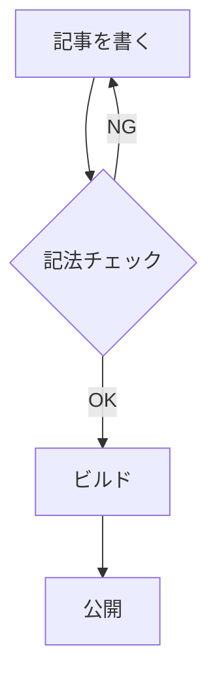

# 本サイトで使える記法のサンプル

本サイトでは Zenn 互換の Markdown 記法に加え、いくつかの拡張記法に対応しています。このページは記法の動作確認と書き方リファレンスを兼ねたサンプルです。

## 見出し / 強調 / リスト

段落中で **太字** や _斜体_、`インラインコード` が使えます。

- 順不同リスト 1
- 順不同リスト 2
  - ネストした項目
- 順不同リスト 3

1. 番号付きリスト 1
2. 番号付きリスト 2

## メッセージボックス

:::message
これは情報メッセージです。記事中で補足を目立たせたいときに使います。
:::

:::message alert
警告メッセージは重要な注意事項に使います。
:::

## 折りたたみ

:::details クリックで展開
折りたたみの中身です。長い補足やコード例を隠しておきたいときに便利です。
:::

## 数式 (KaTeX)

インライン数式の例: アインシュタインの有名な式は $E = mc^2$ と書けます。

ブロック数式:

$$
\int_0^\infty e^{-x^2} \, dx = \frac{\sqrt{\pi}}{2}
$$

## コードブロック

```ts
// シンタックスハイライト付きコードブロック
export const greet = (name: string): string => `Hello, ${name}!`
```

## Mermaid 図



## リンクカード埋め込み

`@[card](URL)` で外部サイトをカード形式で埋め込めます（ビルド時に OGP を取得）。

@[card](https://github.com/nuxt/nuxt)

## YouTube 埋め込み

@[youtube](dQw4w9WgXcQ)

## CodePen / CodeSandbox / StackBlitz

`@[codepen]` / `@[codesandbox]` / `@[stackblitz]` を対応しています。いずれも iframe 埋め込みです。

## Tweet / Gist

Twitter (X) と GitHub Gist もクライアント側で描画できます。以下は書式例です（実在の URL を指定してください）。

```md
@[tweet](https://twitter.com/user/status/1234567890123456789)
@[gist](https://gist.github.com/user/abcdef1234567890abcdef12)
```

## 画像

記事用の画像は `articles/images/<slug>/` や `site-articles/images/<slug>/` に配置し、本文中では `/images/<slug>/file.png` のように参照します（ビルド時に `/articles-images/` へ書き換わります）。

## まとめ

- 静的記法（メッセージ / 折りたたみ / 数式 / コード / YouTube / CodePen / CodeSandbox / StackBlitz）は完全対応
- `@[card]` はビルド時に OGP 取得、自サイト `/ogp-images/` にキャッシュ
- Mermaid / Tweet / Gist はクライアント側で動的描画

このサンプル記事自体は `site-articles/` 配下なので Zenn には公開されません。
